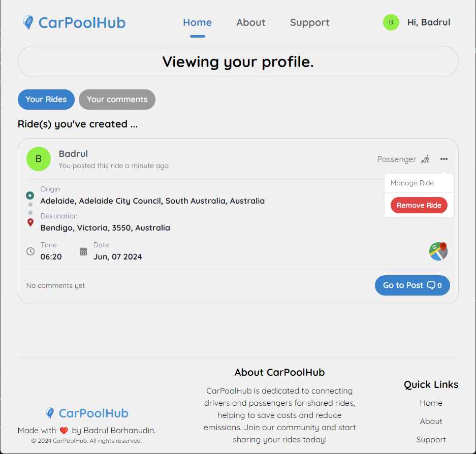

# CarPoolHub

## Description

This project uses everything I’ve learned throughout this course to create a MERN stack single-page application that works with real-world data to solve a real-world challenge, with a focus on data and user demand.

## About the Project

CarPoolHub simplifies ride-sharing, allowing you to effortlessly find or offer rides with just a few taps. By sharing rides, we can significantly reduce the number of cars on the road, leading to less traffic, lower emissions, and substantial savings on fuel costs.

### Built with:

[![MongoDB]][MongoDB-url]
[![Express.js]][Express-url]
[![React.js]][React-url]
[![Node.js]][Node-url]
[![ChakraUI]][Chakra-url]
[![GraphQL]][GraphQL-url]

## Table of Contents

- [Getting Started](#getting-started)
  - [Prerequisites](#prerequisites)
  - [Installations](#installations)
- [Usage](#usage)
- [License](#license)
- [Contributing](#contributing)
- [Tests](#tests)
- [Questions](#questions)
- [Acknowledgements](#acknowledgements)
- [Links](#links)

## Getting Started

[Download](https://github.com/BadrulBorhanudin/carpoolhub) the repository or:

```
git clone git@github.com:BadrulBorhanudin/carpoolhub.git
```

### Prerequisites

You need to have Node JS installed. [Find out more.](https://nodejs.org/en)

### Installations

Once the repo is downloaded to your local:

1. Create .env in /server that will contain the following:

```
JWT_SECRET="YOUR-SECRET-KEY"
JWT_EXPIRATION="YOUR-DESIRED-LENGTH E.G. 2HRS"
LOCATIONIQ_API_KEY="YOUR-LOCATIONIQ-API-KEY"
STRIPE_SECRET_KEY="YOUR-STRIPE-SECRET-KEY"
SUCCESS_URL="http://localhost:3000/success"
```

Note: This setup is configured ready to run in your local environment.

2. Get free [LocationIQ API Key](https://locationiq.com/) and [Stripe Test Keys](https://stripe.com/en-my) here.

3. Install NPM packages:

```
npm i
```

4. Load data seed (optional):

```
npm run seed
```

5. Build the application:

```
npm run build
```

6. Finally, get both client and server to run simultaneously:

```
npm run develop
```

## Usage

1. If you're new to CarPoolHub, Sign Up first.
   
   </br>

2. If you're going to be a passenger, check if there's posted rides that might coincide with the route you'll be taking by filtering the date and posts by driver.
   
   </br>

3. If you can't find any, then start creating one and you'll see your posted ride as per below screenshot
   
   </br>

4. Go to your profile to see the rides you posted and comments you made on other posts. You will use this page to manage all your posts.
   
   </br>

5. If there is a route that matches yours, you can plan with the driver.
   
   </br>

6. You can always go back to your profile to check if there's other comments on the post you commented.
   
   </br>

Installations:

1. How to install the app on you pc:
   
   </br>

2. How to install the app on iOS (similar for Android devices):
   

## License

[![License: ISC]][ISC license-url]
This application is covered under the [ISC license.][ISC license-url]

## Contributing

Give credit to Badrul Borhanudin.

## Tests

There are no tests associated with this project.

## Questions

If you have any questions, you can reach out to me via email at badrulborhanudin@gmail.com. You can also find more information about me and my other projects on my GitHub profile: [BadrulBorhanudin](https://github.com/BadrulBorhanudin)

## Acknowledgements

I would like to thank the following resources and communities for their invaluable support and inspiration in making this project possible:

- This project is purely built from 21-MERN/01-Activities/26-Stu_Resolver-Context.
- UI inspirations were drawn from [Reddit](https://www.reddit.com/), [Dribbble](https://dribbble.com/), [Pinterest](https://www.pinterest.com/) and [Facebook](https://www.facebook.com/).
- The members of the [Developer Group on Discord](https://discord.com/channels/1093904748521996298/1093913093068828672) for their advice, feedback, and support.
- Various online tools and resources that facilitated the development process.
- My instructor, Prabhjot Singh, for his guidance and support.

## Links

- [The URL of the functional, deployed application.](https://carpoolhub.onrender.com/)
- [The URL of the GitHub repository, with a unique name and a README that describes the project.](https://github.com/BadrulBorhanudin/carpoolhub)

<!-- MARKDOWN LINKS & BADGES -->

[React.js]: https://img.shields.io/badge/React-20232A?style=for-the-badge&logo=react&logoColor=61DAFB
[React-url]: https://reactjs.org/
[MongoDB]: https://img.shields.io/badge/MongoDB-47A248?style=for-the-badge&logo=mongodb&logoColor=white
[MongoDB-url]: https://mongodb.com/
[Express.js]: https://img.shields.io/badge/Express.js-000000?style=for-the-badge&logo=express&logoColor=white
[Express-url]: https://expressjs.com/
[Node.js]: https://img.shields.io/badge/Node.js-339933?style=for-the-badge&logo=nodedotjs&logoColor=white
[Node-url]: https://nodejs.org/
[ChakraUI]: https://img.shields.io/badge/Chakra_UI-319795?style=for-the-badge&logo=chakraui&logoColor=white
[Chakra-url]: https://chakra-ui.com/
[GraphQL]: https://img.shields.io/badge/GraphQL-E10098?style=for-the-badge&logo=graphql&logoColor=white
[GraphQL-url]: https://graphql.org/
[License: ISC]: https://img.shields.io/badge/License-ISC-blue.svg
[ISC license-url]: https://opensource.org/licenses/ISC
